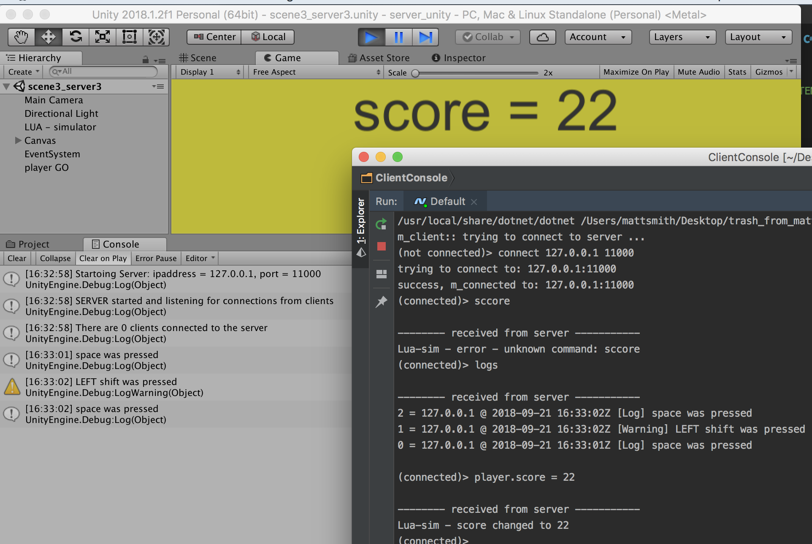

# SSULK
> SSULK - Socket Server for Unity Logging (Kinda)

Project to create a Unity server & C# client. Aims are:

- Server: Unity sends Console Logs (with IP address and Timestamp) to the Client
- Client: can send commands (e.g. LUA) to the Unity game server to be executed

## Installation

### Sever (Unity)

1. Open up folder `server_unity` in the Unity editor
1. Add the only Scene to the Build
1. Build and Run
1. You can generate Log / Warning / Error messages by pressing SPACE / Left-Shift / Right-Shift 

### Client (C# - currently a simple Console application)

1. Open up directory `client_stand_alone` in a C#-.NET IDE (e.g. JetBrains Rider or VSCode)
1. Build and Run
1. At the command line use "connect <ip> <port>" to connect to the server
1. Type "help", "logs", or try "player.score = 22" etc.

## Usage example

Use this to allow someone to interrogate / receive Unity Console logs when quality testing a Unity game

## TODO

- get working with .NET 4.5 for Nintendo Switch builds (works with 3.5)

- get Server to send Console Log messages to the Client as they occur (rathan than list / individual ones being requested by Client)

   - solution found? see file [https://github.com/dr-matt-smith/SSULK/blob/master/server_unity/Assets/_Scripts/SocketServer/Server4.cs](https://github.com/dr-matt-smith/SSULK/blob/master/server_unity/Assets/_Scripts/SocketServer/Server4.cs)

Use this to allow someone to interrogate / receive Unity Console logs when quality testing a Unity game

## Release History

* 0.0.1
    * Basic Proof of Concept

## Meta

Matt Smith – dr_matt-smith@me.com

Distributed under the MIT license. See ``LICENSE`` for more information.

[https://github.com/dr-matt-smith/SSULK](https://github.com/dr-matt-smith/SSULK)

## Contributing

1. Fork it (<https://github.com/dr-matt-smith/SSULK/fork>)
2. Create your feature branch (`git checkout -b feature/fooBar`)
3. Commit your changes (`git commit -am 'Add some fooBar'`)
4. Push to the branch (`git push origin feature/fooBar`)
5. Create a new Pull Request

